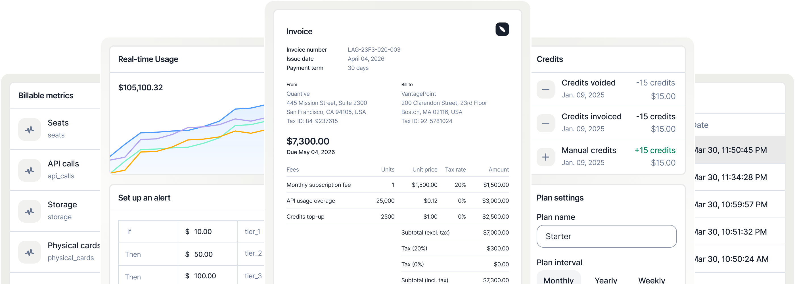
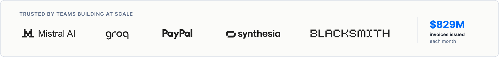
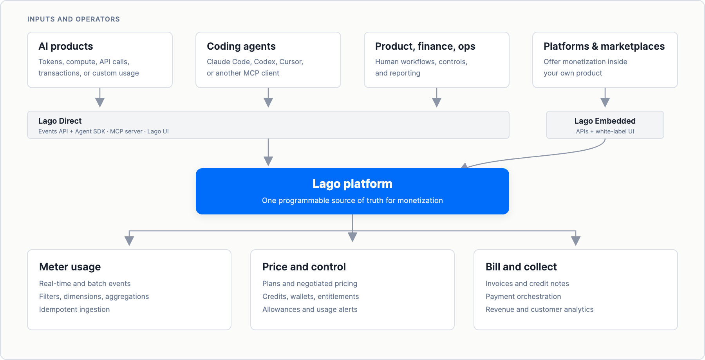

<!-- PROJECT LOGO -->
<div align="center">
  <a href="https://github.com/getlago/lago">
    
  </a>

  <h1 align="center">Lago</h1>

  <p>
    <strong>Agentic-first, open-source monetization infrastructure for AI products</strong>
    <br />
    Meter tokens, compute, API calls, or any product usage.<br />
    Turn usage into pricing, credits, entitlements, invoices, payments, and revenue.
    <br />
    Use Lago Direct for your own product, or Lago Embedded to power monetization for your customers.
    <br />
    <br />
    <a href="#see-lago-price-an-ai-workload"><strong>Run the AI billing demo</strong></a>
    ·
    <a href="https://doc.getlago.com"><strong>Documentation</strong></a>
    ·
    <a href="https://www.getlago.com/pricing"><strong>Talk to us about Lago Cloud</strong></a>
  </p>
</div>

<p align="center">
  <a href="https://github.com/getlago/lago/stargazers"></a>
  <a href="https://github.com/getlago/lago/releases"></a>
  <a href="https://github.com/getlago/lago/blob/main/LICENSE"></a>
  <a href="https://www.getlago.com/slack"></a>
</p>

<p align="center">
  
</p>

<p align="center">
  <em>“Lago has been able to follow the pace of our releases and has allowed us to focus on what we do best.”</em>
  <br />
  <strong>Timothée Lacroix, CTO at Mistral AI</strong>
  ·
  <a href="https://getlago.com/blog/mistral-billing">Read the customer story</a>
</p>

---

## See Lago price an AI workload

Run the maintained demo from this repository:

```bash
./examples/agentic-ai-demo/run.sh
```

It starts the Lago version that matches this checkout, creates a disposable local organization, and prices three illustrative AI requests. Each request sends one input-token event and one output-token event:

```text
3 AI requests
5,000 input tokens  x $0.000002 = $0.01
1,250 output tokens x $0.000008 = $0.01
Lago usage total                   = $0.02
```

Docker Compose starts an isolated Lago service, then a small script seeds and verifies the example through Lago's API. It retrieves current usage, independently reconciles the result, and retries one transaction to confirm that usage does not increase. Everything stays on your machine; the demo does not access Lago Cloud. The bundled credentials and API key are disposable and only intended for this local demo.

Log into [http://localhost:8080](http://localhost:8080) with `agentic-ai-demo@example.local` / `agentic-ai-demo-local-password`, then open **Customers → Agentic AI Demo Customer → Agentic AI Demo subscription → Usage**.

Requirements: Docker, `curl`, and `jq`. If ports 8080 or 3001 are occupied, set `LAGO_DEMO_UI_PORT` and `LAGO_DEMO_API_PORT` before running. The demo keeps Lago running so you can inspect the customer, metrics, plan, subscription, events, and usage in the UI. Remove its isolated Compose project and data volume when you are done:

```bash
./examples/agentic-ai-demo/run.sh --cleanup
```

<details>
<summary><strong>Use Claude Code, Codex, or Cursor</strong></summary>

Open this repository in your coding agent and paste:

```text
Run Lago's maintained Agentic AI demo by following this README. Keep it local;
do not modify source files or unrelated Docker resources. When it passes, give
me the UI URL, token usage and charges, idempotency evidence, and cleanup
command. Then offer to connect this agent to Lago's local MCP server.
```

</details>

## What is Lago?

Lago is the programmable system between product usage and revenue. Send events from your application, turn them into billable metrics, apply pricing and entitlements, then generate invoices and collect payments.

```text
Usage events -> Metering -> Pricing and credits -> Entitlements -> Invoices -> Payments -> Revenue
```

Use Lago to launch and change pricing without rebuilding billing:

- tokens by model, input, output, cache, reasoning, or tool call
- GPU, CPU, storage, and other compute consumption
- API calls, transactions, seats, active users, or custom events
- prepaid credits with automatic top-ups
- subscriptions with allowances, minimum commitments, and overages
- self-serve plans and negotiated enterprise contracts in the same system

Lago is headless and API-first. Your application, internal tools, and agents use the same billing primitives through the REST API, SDKs, webhooks, and MCP server. Product, finance, and operations teams can use the Lago UI when a human interface is faster.

## How Lago fits into your stack

<p align="center">
  
</p>

Lago keeps metering and pricing independent from payment processing. Connect Stripe, Adyen, GoCardless, or another provider without making its product catalog your source of truth.

## Lago Direct and Lago Embedded

The same Lago engine supports two operating models:

| | **Lago Direct** | **[Lago Embedded](https://getlago.com/platform/embedded)** |
|---|---|---|
| **Who monetizes** | You monetize your own product | Your customers monetize through your platform |
| **Experience** | Your application and teams use Lago through APIs, agent interfaces, and Lago UI | Your customers use billing capabilities inside your product through APIs and white-label interfaces |
| **Brand** | Lago powers your billing stack | Lago stays behind the scenes under your brand |
| **Public example** | [Mistral AI](https://getlago.com/blog/mistral-billing) | [PayPal](https://getlago.com/blog/paypal-x-lago) |

**Lago Direct** is the standard way to use Lago: send your own product usage, model your pricing, and bill your customers. **Lago Embedded** uses the same primitives to let platforms, marketplaces, AI builders, fintech products, and developer tools offer metering and billing to their customers.

Both models start with Lago's open-source billing engine and can be paired with Premium deployment, customization, security, and support options. With Lago Embedded, you control the customer experience and which capabilities your users can access.

## Agentic-first by design

Agentic-first means Lago's billing model is available as structured, inspectable interfaces instead of being trapped in a dashboard.

| Interface | What it enables | Availability |
|---|---|---|
| **[REST API and OpenAPI](https://github.com/getlago/lago-openapi)** | Program every core billing workflow and generate typed clients or tools from the schema | Open source |
| **[Lago MCP server](https://github.com/getlago/lago-agent-toolkit)** | Give an MCP-compatible agent tools to read and write invoices, usage, customers, payments, credit notes, coupons, and other Lago primitives | Open source, MIT |
| **[Lago Agent SDK for Python](https://github.com/getlago/lago-agent-sdk-python)** | Wrap supported LLM clients, normalize usage, and send token or model-cost events without blocking the LLM call | Open source, MIT |
| **[Lago Agent SDK for JavaScript and TypeScript](https://github.com/getlago/lago-agent-sdk-js)** | Instrument OpenAI, Anthropic, Mistral, Gemini, and AWS Bedrock clients with under 5 ms p99 wrapper overhead | Open source, MIT |
| **[Finance Assistant](https://www.getlago.com/platform/ai)** | Ask read-only questions about billing, usage, and revenue in plain language | Beta, early access |
| **[Billing Assistant](https://doc.getlago.com/guide/ai-agents/billing-assistant)** | Query billing data and run operations in natural language, with confirmation for important or destructive actions | Premium beta, available upon request |

The MCP server exposes read and write tools and inherits the permissions of its Lago API key. Treat agent credentials as privileged, control who can access the agent, review tool calls, and keep human confirmation around sensitive billing changes.

## Platform

| Layer | Capabilities |
|---|---|
| **Meter usage** | Real-time event ingestion, filters, dimensions, custom aggregations, batch ingestion, and idempotency by `transaction_id` |
| **Model pricing** | Usage-based, recurring, prepaid, percentage, graduated, package, volume, minimum-commitment, and hybrid charges |
| **Control access** | Entitlements, allowances, wallets, credit grants, top-ups, and usage alerts |
| **Bill customers** | Subscriptions, invoices, credit notes, taxes, multiple currencies, multiple entities, and customer-specific overrides |
| **Collect revenue** | Payment-provider orchestration, retries, dunning, and payment-status synchronization |
| **Understand revenue** | Usage, MRR, invoice, customer, and revenue analytics |
| **Connect the stack** | Salesforce, HubSpot, NetSuite, Xero, Avalara, cloud marketplaces, data warehouses, and webhooks |
| **Lago Direct** | Meter and bill your own customers through Lago APIs, agent interfaces, and UI |
| **[Lago Embedded](https://getlago.com/platform/embedded)** | White-label metering and billing for platforms, marketplaces, AI builders, and fintech products |

Explore [metering](https://www.getlago.com/products/metering), [billing and invoicing](https://www.getlago.com/products/invoicing), [entitlements](https://www.getlago.com/platform/entitlements), [cash collection](https://www.getlago.com/platform/cash-collection), [revenue analytics](https://www.getlago.com/platform/revenue-analytics), and [integrations](https://doc.getlago.com/integrations/introduction).

## Production characteristics

- **Idempotent ingestion.** Lago deduplicates usage events by `transaction_id`, so retrying an event does not bill it twice. [Read the ingestion guide](https://doc.getlago.com/guide/events/ingesting-usage).
- **Atomic batches.** If one event in a batch is invalid, Lago rejects the batch and persists none of its events. [Read the batch API reference](https://doc.getlago.com/api-reference/events/batch).
- **Asynchronous processing.** Dedicated workers can isolate events, billing, payments, invoices, webhooks, PDFs, alerts, and analytics as volume grows. [Review the architecture](./docs/architecture.md).
- **Observable operation.** Lago exposes Prometheus metrics for APIs, queues, workers, events, billing, webhooks, and dependencies. [Review monitoring](./docs/monitoring.md).
- **Deployment control.** Run Lago locally, in your cloud, or on your infrastructure. Production deployments can separate and scale stateful services and workers independently.
- **Security.** Lago is SOC 2 Type II certified and supports self-hosting for teams that need infrastructure and data control. [Review security](https://www.getlago.com/security).

## Chosen by teams operating at scale

Mistral AI, Groq, PayPal, Synthesia, Blacksmith, and other teams have publicly selected Lago for billing. The figures below describe the companies using Lago, not volume processed by Lago.

| Company | Lago use | Public company context |
|---|---|---|
| **[Mistral AI](https://getlago.com/blog/mistral-billing)** | Token metering, prepaid credits, invoicing, taxes, and payment collection for paid AI products | Reported at more than $400M in annualized revenue run rate |
| **[Groq](https://getlago.com/customers)** | Lago customer | More than 5M developers and trillions of AI tokens processed weekly |
| **[Blacksmith](https://getlago.com/blog/blacksmith-billing)** | Usage-based billing for compute-intensive CI workloads | More than 6,000 companies; raised a $45M Series B at a $550M valuation |
| **[Synthesia](https://getlago.com/customers)** | Lago customer | Approximately $140M ARR |
| **[PayPal](https://getlago.com/blog/paypal-x-lago)** | Embedded, usage-based billing for merchants | More than 430M active accounts worldwide |

Sources for company context: [Mistral AI](https://observer.com/2026/07/arthur-menschs-mistral-is-europes-best-bet-for-sovereign-a-i/), [Groq](https://groq.com/newsroom/groq-raises-usd650m-to-scale-its-ai-inference-cloud-business), [Blacksmith](https://www.blacksmith.sh/blog/announcing-blacksmiths-series-b-led-by-peak-xv-partners), [Synthesia](https://www.synthesia.io/post/how-we-scaled-our-billing-system-from-40m-to-140m-arr), and [PayPal](https://newsroom.paypal-corp.com/2026-07-02-PayPal-Joins-the-European-Payments-Council).

## Open source and managed options

| Option | Best for | Access |
|---|---|---|
| **Lago open source** | Teams that want to inspect, extend, and operate the billing platform on their infrastructure | This repository, AGPLv3 |
| **Agent tooling** | Teams that want to meter LLM usage or expose billing primitives to agents | Separate open-source Agent SDK and MCP repositories, MIT |
| **Lago Cloud** | Teams that want Lago to operate the platform and provide commercial support | [Talk to us](https://www.getlago.com/pricing) |
| **Premium capabilities** | Teams that need selected assistants, enterprise integrations, governance, or embedded use cases | Availability varies by feature; [talk to us](https://www.getlago.com/pricing) |

## Deploy Lago

For a source-based local deployment:

```bash
git clone --depth 1 https://github.com/getlago/lago.git
cd lago

echo "LAGO_RSA_PRIVATE_KEY=\"$(openssl genrsa 2048 | openssl base64 -A)\"" >> .env
docker compose up -d
```

Use the [self-hosted deployment guide](https://doc.getlago.com/guide/lago-self-hosted/docker#configuration) for persistent storage, SMTP, TLS, object storage, Redis, database configuration, and upgrades. For larger deployments, use the [Lago Helm charts](https://github.com/getlago/lago-helm-charts) and configure [dedicated workers](./docs/architecture.md#dedicated-workers).

## SDKs and developer resources

| Language | Client |
|---|---|
| **Node.js** | [lago-javascript-client](https://github.com/getlago/lago-javascript-client) |
| **Python** | [lago-python-client](https://github.com/getlago/lago-python-client) |
| **Ruby** | [lago-ruby-client](https://github.com/getlago/lago-ruby-client) |
| **Go** | [lago-go-client](https://github.com/getlago/lago-go-client) |

- [Getting started](https://doc.getlago.com)
- [API reference](https://doc.getlago.com/api-reference)
- [OpenAPI specification](https://github.com/getlago/lago-openapi)
- [Pricing templates](https://getlago.com/docs/templates/introduction)
- [Architecture](./docs/architecture.md)
- [Monitoring](./docs/monitoring.md)
- [Changelog](https://doc.getlago.com/changelog)
- [Public roadmap](https://getlago.canny.io/)
- [System status](https://status.getlago.com/)

## Contributing

Lago is built in the open. Read the [contributing guide](./CONTRIBUTING.md) and [development environment setup](./docs/dev_environment.md) to get started.

Look for issues labeled [`beginner`](https://github.com/getlago/lago/issues?q=is%3Aissue%20state%3Aopen%20label%3Abeginner) or [`help-wanted`](https://github.com/getlago/lago/issues?q=is%3Aissue%20state%3Aopen%20label%3Ahelp-wanted), or join the [Lago Slack community](https://www.getlago.com/slack).

## License

The Lago platform is distributed under the [AGPLv3 license](./LICENSE). Read [why Lago chose AGPLv3](https://www.getlago.com/blog/open-source-licensing-and-why-lago-chose-agplv3). Lago's Agent SDKs and MCP server are distributed from separate repositories under the MIT license.

## Analytics and tracking

Self-hosted Lago instances collect basic product analytics by default. Lago does not collect customer PII or financial data through this tracking. [Review what is collected or opt out](https://doc.getlago.com/guide/lago-self-hosted/tracking-analytics).
