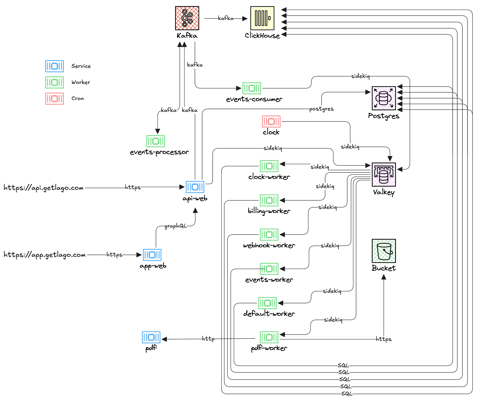

# Application Architecture

This document summarizes the application's architecture and core flows.

---

## Global Architecture Diagram

Below is a conceptual diagram representing the main components and their interactions within the application:

## Usage event

When a user is consuming some resources from the customer a usage event is sent to Lago:

> [!NOTE]
> _A detailed architecture diagram will be added to this section in a future update._

## Billing creation

At least once a month a bill is issued to the users. The flow is as follow

> [!NOTE]
> _A detailed architecture diagram will be added to this section in a future update._

## Glossary

**Customer**: An individual or entity that operates within the application, typically representing an organization or team that manages billing, subscriptions, or other business operations. Customers interact with the system to configure, monitor, and manage their own users and related resources.

**User**: An external party or account that is billed or managed by a customer. Users are the end recipients of services, subscriptions, or usage tracked by the application, and are associated with billing events, invoices, and usage records generated by the customer's organization.
